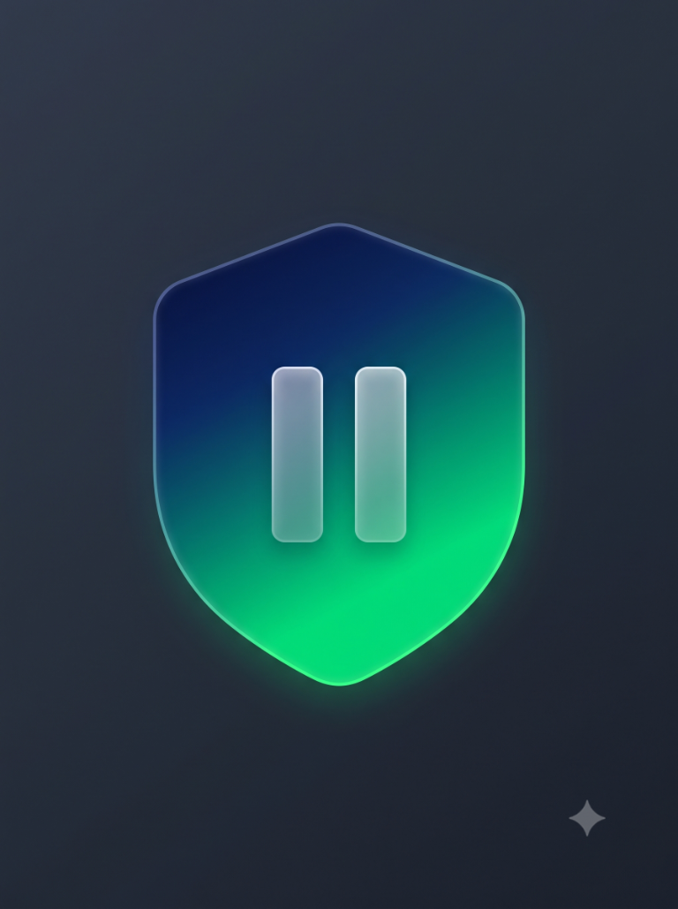
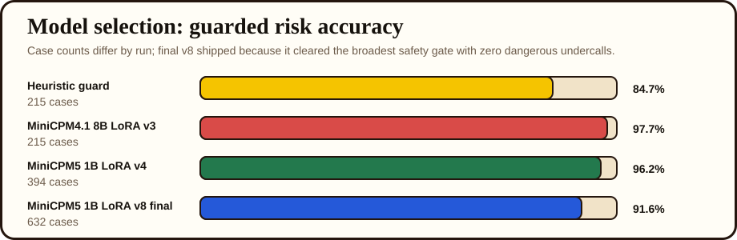

  

# PhishBrake

Scam defense for someone you love.

**Initiative:** ML Empowerment Build Challenge 3.0  
**Maintained by:** The Jawbreaker Team

**Why this exists:** The motivating user is a friend's grandmother who had already been affected by scam messages. Private details are intentionally omitted, but that family context shaped the product: this is not a generic spam classifier for security experts; it is a calm safety check for someone who needs to know whether to reply, click, call, or ask for help.

## Project Summary

- **Purpose:** a plain-language safety check for suspicious texts, emails, and DMs.
- **Local model:** MiniCPM5-1B GGUF through `llama-cpp-python`.
- **Safety:** schema validation, deterministic action checks, and heuristic fallback behavior.
- **Evaluation:** synthetic and sanitized cases in `eval/`, with reports under `eval/reports/`.

PhishBrake is built around direct small-model inference to protect user privacy. The local default uses the MiniCPM5-1B base GGUF; a Transformers backend and an optional adapter remain configurable for deployments that use them.

PhishBrake helps a real person pause before clicking, replying, or sending money. Paste a suspicious text, email, or DM and PhishBrake breaks it into plain-English warning signs: what the sender is pretending to be, what pressure tactic is being used, what they want, and the safest next step.

The problem is specific: scam messages now arrive as urgent, personal, plausible requests. A package fee, a bank callback, a fake recruiter, or a "new phone number" from a family member can pressure someone into clicking or paying before they ask for help. PhishBrake turns that moment into a small safety workflow: paste the message, get a clear verdict, see the warning signs, see whether the message needs more context, and copy a short note to someone you trust.

## Demo

Run the app locally using the steps in [`SETUP.md`](SETUP.md), then submit a sanitized suspicious message.

## ML Empowerment Build Challenge 3.0

PhishBrake is maintained by The Jawbreaker Team for the ML Empowerment Build Challenge 3.0. The project focuses on a practical scam-safety workflow, with a local small-model runtime, transparent limitations, and reproducible evaluation artifacts.

## Why This Is Small

PhishBrake is deliberately narrow. It does not try to be a general assistant or chatbot. It performs one safety task:

1. Read one suspicious message.
2. Identify scam risk and manipulation tactics.
3. Give one clear safe action.
4. Surface uncertainty when a message is too short or missing context.
5. Help the user ask someone they trust with a copyable warning note.

## What's Inside

| Component | Model / Library | Where it runs |
| --- | --- | --- |
| Scam analysis | MiniCPM5-1B Q4_K_M GGUF base model | Local `llama-cpp-python` runtime |
| Safety guard | Schema validation + deterministic heuristic guard | App runtime |
| Interface | Custom `gr.Server` kitchen-table UI | Local Gradio app |
| Training/eval | PEFT/LoRA + guarded eval harness | Optional research workflow |

## Model Runtime

The default local app uses the MiniCPM5-1B base model in GGUF format through `llama-cpp-python`. The repository also retains a configurable Transformers path and the previously trained adapter for comparison and reproducibility:

- Historical comparison: PhishBrake MiniCPM5-1B LoRA v8; not included in the default local GGUF.
- Training: PEFT/LoRA on Modal A100
- Eval: guarded Modal A100 run across the 632-case hard v8 suite, with earlier 320/394-case v4 comparison runs
- Runtime: local CPU by default, with optional GPU offload through llama.cpp
- The local GGUF is the base model and does not include the PhishBrake LoRA weights.

Why this model:

- It keeps the app runnable with a compact local model and no hosted inference API.
- It is a compact 1B model suited to a narrow task.
- The historical 1B v8 adapter cleared the broader 632-case safety gate.
- It avoids external commercial model APIs.
- It can produce the structured JSON that PhishBrake validates before rendering.

The eval tools also support Transformers and saved-prediction backends for comparing historical model runs.

Safety architecture:

- Model output must parse as JSON and match the required schema.
- A deterministic heuristic guard catches weak model outputs that under-call obvious danger.
- If MiniCPM generation fails or returns malformed JSON, PhishBrake falls back to deterministic safety analysis instead of showing an unusable error state.
- The UI always recommends verification through official channels or a known phone number, never the suspicious link or number.
- Session memory is local to the current Gradio session and helps show repeated scam patterns.

## Model Selection Evidence

| Candidate | Size | Eval set | Risk accuracy | Dangerous -> safe | Dangerous -> needs check | Safe -> dangerous/suspicious | Invalid JSON | Unsafe actions | Why not final |
| --- | ---: | --- | ---: | ---: | ---: | ---: | ---: | ---: | --- |
| Heuristic guard | none | 215 hard cases | 84.7% | 0 | 0 | 0 | 0 | 0 | Guard layer only, not model-led. |
| MiniCPM4.1 LoRA v3 | 8B | 215 hard cases | 97.7% | 0 | 0 | 0 | 0 | 0 | Strong, but larger than the local default. |
| MiniCPM5 LoRA v4 | 1B | 394 hard cases | 96.2% | 0 | 0 | 3 | 0 | 0 | Strong, narrower eval and a few safe-message overcalls. |
| MiniCPM5 LoRA v8 | 1B | 632 hard cases | 91.6% | 0 | 0 | 0 | 0 | 0 | **Final: broadest safety gate.** |

The historical 1B v8 adapter cleared the broadest completed hard safety gate in the included reports. The local default is the base GGUF and should not be represented as that fine-tuned adapter.

`Qwen/Qwen3-0.6B` was an earlier runtime candidate and remains available for evaluation, but it is not included in the numeric comparison because the committed reports cover the heuristic guard and MiniCPM LoRA candidates.

Training/eval artifacts:

- Sanitized/synthetic evals, generated training splits, and reports are included under `eval/` and `training/data/`.
- `eval/scam_eval.jsonl`: 100 hand-curated synthetic/sanitized eval cases.
- `eval/field_examples.jsonl`: sanitized real-world examples from a friend, with names and phone numbers removed.
- `training/generate_jawbreaker_data.py`: deterministic generator for larger train/dev/test splits.
- `training/generate_v3_data.py`: contrastive hard-case generator used for the v3 LoRA pass.
- `training/generate_v4_data.py`, `generate_v5_data.py`, `generate_v6_data.py`, `generate_v7_data.py`, `generate_v8_data.py`: later calibration generators used to stress-test false positives, trusted-route boundaries, fresh public scam patterns, and wrong-number investment grooming.
- `training/data/train.jsonl`, `dev.jsonl`, `test.jsonl`: generated SFT records for PhishBrake JSON behavior.
- `training/data/train_v3.jsonl`, `dev_v3.jsonl`, `test_v3.jsonl`: v3 contrastive training split.
- `eval/generated_eval.jsonl`: generated holdout eval set.
- `eval/hard_v2_eval.jsonl`: hard eval set used to compare v2 and v3 adapters.
- `eval/hard_v4_eval.jsonl`, `hard_v5_eval.jsonl`, `hard_v6_eval.jsonl`, `hard_v7_eval.jsonl`, `hard_v8_eval.jsonl`: expanded hard evals used during 1B calibration.
- `eval/reports/jawbreaker-minicpm5-1b-lora-v8-hard632-safetyguard-v4.json`: main final model evidence.
- `training/train_lora.py`: PEFT/LoRA script for publishing PhishBrake MiniCPM adapters.
- `training/modal_train.py`: Modal A100 training launcher used for the MiniCPM LoRA passes.
- `training/modal_eval.py`: Modal A100 eval launcher used for guarded hard-suite scoring.
- `HONEST_SUBMISSION.md`: guardrails to avoid overclaiming synthetic data, fine-tuning, or runtime behavior.

## Initiative

PhishBrake is developed by The Jawbreaker Team for the ML Empowerment Build Challenge 3.0. The project keeps its claims tied to included code and evaluation artifacts; historical adapter scores are not claims about the default base GGUF.

## Limitations / Safety Boundary

PhishBrake is not legal, financial, or cybersecurity advice. It is a local-first safety aid that helps non-experts slow down and verify suspicious messages. The safest action should never ask the user to click the suspicious link or call a number from the suspicious message.

`FIELD_NOTES.md` is a build-observation log: product decisions, model/runtime pivots, eval results, and packaging notes. It is not presented as ethnographic user research.
